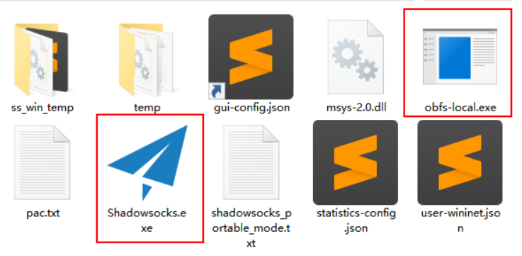
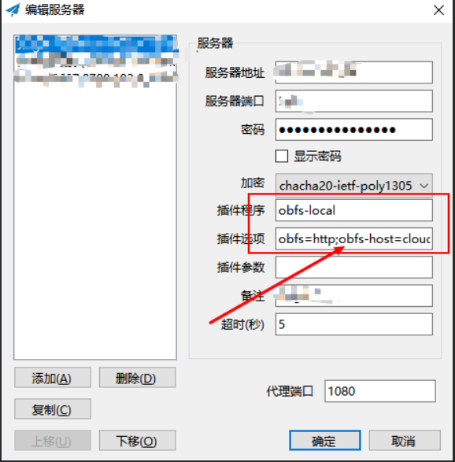
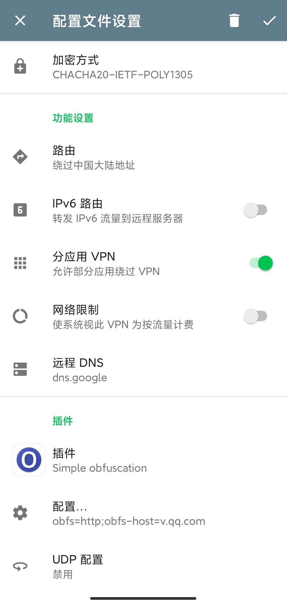

# VPS上配置shadowsocks-libev步骤
## 1. 安装shadowsocks-libev
1. 复制脚本到服务器
	
```shell
wget --no-check-certificate -O shadowsocks-all.sh https://raw.githubusercontent.com/teddysun/shadowsocks_install/master/shadowsocks-all.sh
```

1. 运行脚本安装
```shell
chmod +x shadowsocks-all.sh
./shadowsocks-all.sh 2>&1 | tee shadowsocks-all.log
```

3. 运行过程中会有多种选项需要选择

	1. 加密方式推荐 **chacha20-itef-poly1305**, 
	2. 端口可以尽量设置高一点,避免443, 1080等常用端口, 
	3. **安装 simple-obfs , 选择 http 模式**
	4. 设置密码，客户端密码需要与此相同
4. 完成安装显示如下内容
```shell
Congratulations, your_shadowsocks_version install completed!
Your Server IP        :your_server_ip
Your Server Port      :your_server_port
Your Password         :your_password
Your Encryption Method:your_encryption_method

Your QR Code: (For Shadowsocks Windows, OSX, Android and iOS clients)
ss://your_encryption_method:your_password@your_server_ip:your_server_port
Your QR Code has been saved as a PNG file path:
 your_path.png

Welcome to visit:https://teddysun.com/486.html
Enjoy it!
```
**可以将二维码文件下载到本地，用于客户端扫描**
5. 常用命令
```
./shadowsocks-all.sh uninstall #卸载
启动：/etc/init.d/shadowsocks-libev start
停止：/etc/init.d/shadowsocks-libev stop
重启：/etc/init.d/shadowsocks-libev restart
查看状态：/etc/init.d/shadowsocks-libev status

```
6. 配置文件地址
```
/etc/shadowsocks-libev/config.json
```
## 2. windows客户端配置

1. [Win Shadowsocks客户端下载地址](https://github.com/shadowsocks/shadowsocks-windows/releases)
2. [Shadowsocks obfs-local插件下载地址](https://github.com/shadowsocks/simple-obfs/releases)
3. 解压客户端软件和插件
4. 插件放在Shadowsocks.exe相同目录下

5. obfs可以直接在Shadowsocks的服务器编辑页面修改参数
6. 插件选项为 **obfs=http;obfs-host=www.bing.com**, 实际上可以将 www.bing.com 更换为任意的一个网址, 只要不是被GFW封杀的就可以, 推荐像腾讯视频, 优酷, bing这种流量较大的网站

## 3. Android客户端配置

1. 下载[Shadowsocks 安卓客户端](https://github.com/shadowsocks/shadowsocks-android/releases)，安装
2. 下载安装Simple obfuscation

3. 扫描二维码完成基本配置
4. 设置 **【插件】** 和 **【配置...】**




***
本文部分参考[https://github.com/KeiKinn/ShadowsocksBio](https://github.com/KeiKinn/ShadowsocksBio)